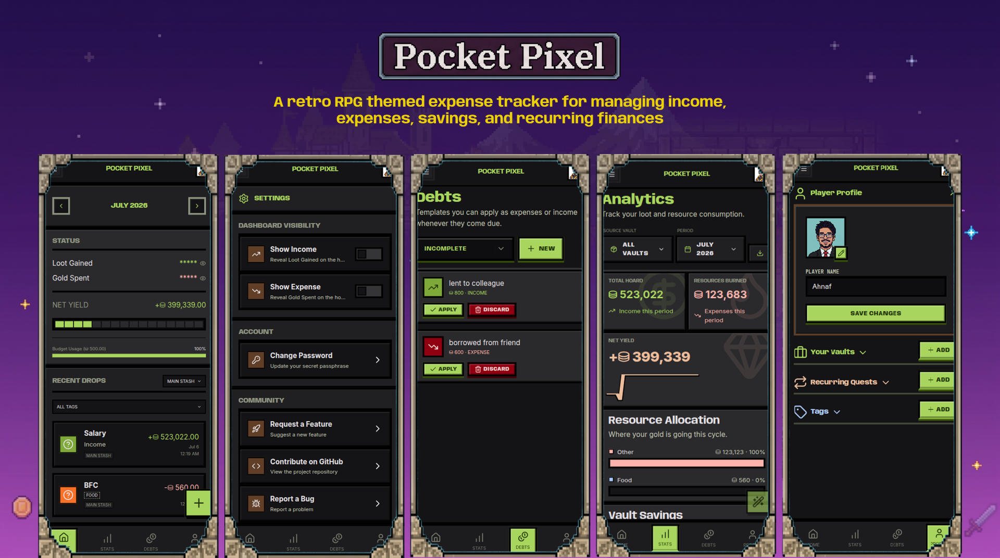

<div align="center">

# Pocket Pixel — Expense Tracker

**Level up your finances. Track every coin, quest every habit.**

[](https://github.com/ali-ahnaf/pocket_pixel/actions/workflows/ci-cd.yml)
[](LICENSE)
[](https://www.typescriptlang.org/)
[](https://nextjs.org/)
[](https://expressjs.com/)
[](https://typeorm.io/)
[](CONTRIBUTING.md)
[](https://github.com/ali-ahnaf/pocket_pixel)



</div>

## What is Pocket Pixel?

Pocket Pixel is a **gamified personal finance tracker** built for people who want to make budgeting actually fun. Inspired by retro RPG aesthetics, it wraps your income and expenses in a pixel-art UI where categories become **Vaults**, habits become **Quests**, and every transaction is part of your financial adventure.

- **Vaults** — organize spending into themed buckets (food, rent, subscriptions, anything)
- **Recurring Quests** — automate repeating transactions on daily, weekly, monthly, or yearly schedules
- **Tags** — label transactions with custom icons and colors for granular analytics
- **Analytics** — monthly and yearly breakdowns, tag-based insights
- **Profiles** — pick your avatar and make it your own
- **Transaction auto-import** — watch a Gmail label (bank/card alerts) and turn matching emails into transactions automatically, no manual entry
- **AI-Assisted Parsing** — a review queue for emails that need a closer look; parsed client-side in your browser using your own OpenRouter API key
- **Wizard Assistant** — an in-character chat guide that reads your vaults/transactions and gives spending advice, also powered by your own AI key
- **Push Notifications** — get pinged when a new pending expense is waiting for review

### 🔐 User-managed, not shared

Pocket Pixel doesn't ship with a shared Google OAuth client or a shared AI API key. Every user connects **their own** Gmail OAuth client and brings **their own** OpenRouter key:

- Gmail OAuth credentials are encrypted at rest on the server (AES-256-GCM).
- The OpenRouter key is encrypted **client-side** (DEK-based, end-to-end) before it ever leaves your browser — the server only ever stores opaque ciphertext and never sees your plaintext key.
- No email body is parsed or stored server-side. Matching emails are held as a pointer (message id + vault) in a pending queue; the actual parsing happens in your browser with your own key.

See [`documentation/gmail-integration.md`](documentation/gmail-integration.md) for the full setup (GCP project, Pub/Sub, OAuth client, per-user onboarding).

---

## Project Structure

```
pocket_pixel/
├── packages/
│   ├── api/          # Express REST API + TypeORM entities
│   │   └── src/
│   │       ├── entities/     # User, Expense, Vault, Tag, TransactionTag, VaultGmailWatcher, PendingGmailExpense
│   │       ├── routes/       # auth, users, transactions, vaults, tags, recurring, analytics,
│   │       │                 # vault-watchers, pending-expenses, ai-credentials, oauth (Google/Gmail)
│   │       ├── services/     # gmail.service (watch + webhook), pending-gmail-expense, user-ai-credential,
│   │       │                 # user-oauth-credential (encrypted Google tokens), ...
│   │       ├── middleware/   # JWT auth, error handling
│   │       └── scheduler/   # node-cron recurring job manager + daily Gmail watch renewal
│   │
│   ├── ui/           # Next.js frontend
│   │   └── src/
│   │       ├── app/          # Dashboard, Profile, Stats, Auth pages
│   │       ├── components/   # Modals, AppBar, Nav, UI primitives
│   │       └── lib/          # API clients, helpers, icon mapper
│   │
│   └── shared/       # Shared TypeScript types/interfaces
│
├── ecosystem.config.js   # PM2 production config
├── tsconfig.base.json
└── package.json          # Workspace root
```

---

## Getting Started

### Clone the repo

```bash
git clone git@github.com:ali-ahnaf/pocket_pixel.git
cd pocket_pixel
npm install
npm run build:shared # builds shared dependencies
npm run migration:run # creates/updates the .sql file
```

### Create .env files

Create `.env` files for both the api and the ui

- Copy `.env.example` to `.env` for both the api and the ui
- Fill the .env files with the appropriate values (or keep the defaults for local development)

### Development

Run the API and UI in separate terminals:

```bash
# Terminal 1 — API (http://localhost:4000)
npm run dev:api

# Terminal 2 — UI (http://localhost:3000)
npm run dev:ui
```

### Test

```bash
# API tests
npm run test:api

# UI E2E tests
npm run test:e2e
```

### Production Build

```bash
# Build shared → UI → API in order
npm run build:prod

# run migrations and saves the file in /var/www/pocket_pixel
npm run migration:run-prod

# Start the server (API serves the compiled UI)
pm2 start ecosystem.config.js
# → http://localhost:4000
```

---

## API Reference

All endpoints are prefixed with `/api`. Protected routes require an `Authorization: Bearer <token>` header.

---

## Database

SQLite database managed via TypeORM with migrations.

Run migrations:

```bash
npm run migration:run        # Apply pending migrations
npm run migration:generate   # Generate migration from entity changes
npm run migration:revert     # Roll back the last migration
```

---

## Database Backups (Cloudflare R2)

The API can snapshot the SQLite database and upload it to **Cloudflare R2** (an S3-compatible object store) every **12 hours**. It's **off by default** — flip `ENABLE_BACKUP=true` in the API `.env` to turn it on. Backups use SQLite's online backup API, so snapshots stay consistent even while the app is writing.

Each run uploads an object named `pocket_pixel/pocket_pixel-<timestamp>.sqlite` to your bucket.

> **Why R2?** The free tier includes **10 GB storage** and, unlike most clouds, **zero egress fees** — you can pull your backups down for free. That's plenty for a SQLite file.

### 1. Create a Cloudflare account & enable R2

1. Sign up (or log in) at [dash.cloudflare.com](https://dash.cloudflare.com) — the account is free.
2. In the sidebar open **R2 Object Storage** and click **Enable R2**. Cloudflare asks for a payment method to verify identity, but you are **not charged** while you stay within the free tier limits.

### 2. Create a bucket

1. Go to **R2 → Create bucket**.
2. Name it (e.g. `pocket-pixel-backups`) and create it. The location hint can stay on **Automatic**.
3. Remember this name — it's your `R2_BUCKET`.

### 3. Create an API token

1. On the R2 overview page click **Manage R2 API Tokens → Create API Token**.
2. Permission: **Object Read & Write**.
3. Scope it to the bucket you just created (recommended), then **Create**.
4. Copy the **Access Key ID** and **Secret Access Key** — the secret is shown **only once**.

### 4. Find your Account ID

Your **Account ID** is on the R2 overview page (and in the S3 endpoint Cloudflare shows: `https://<ACCOUNT_ID>.r2.cloudflarestorage.com`). Copy it.

### 5. Configure the API `.env`

Add these to `packages/api/.env` (see `packages/api/.env.example`):

```bash
ENABLE_BACKUP=true
R2_ACCOUNT_ID=your-account-id
R2_ACCESS_KEY_ID=your-access-key-id
R2_SECRET_ACCESS_KEY=your-secret-access-key
R2_BUCKET=pocket-pixel-backups
```

Restart the API to pick them up (`pm2 restart ecosystem.config.js` in production, or restart `npm run dev:api` locally). On boot you should see `Database backup scheduled every 12 hours to R2` in the logs. If R2 credentials are missing while `ENABLE_BACKUP=true`, the scheduler logs a warning and stays idle instead of crashing.

### Restoring a backup

1. Download the desired `.sqlite` object from your R2 bucket (Cloudflare dashboard or any S3 client).
2. Stop the API.
3. Replace the live database file (`/var/www/pocket_pixel/pocket_pixel.sqlite` in production, or `packages/api/pocket_pixel.sqlite` locally) with the downloaded file.
4. Start the API again.

---

## Features In Depth

### Vaults

Organize your money into custom buckets — think of them as tagged envelopes. Each vault has a name, icon (from Lucide), background color, and can be marked as your default. Transactions without a vault fall into the default one.

### Recurring Quests

Set a transaction to auto-repeat on a schedule (`daily` / `weekly` / `monthly` / `yearly`). The API scheduler restores all active quests on startup using node-cron, so nothing gets missed between restarts.

### Analytics

Three views to understand your spending:

- **Tag breakdown** — which labels are eating your budget
- **Monthly report** — income vs. expenses by month
- **Yearly report** — long-term trend across all months

### Gmail Auto-Import & AI Parsing

Connect Gmail, pick a label (e.g. a filter that tags bank alert emails), and point it at a vault. Google pushes new mail to the API via Pub/Sub in real time:

1. A confident, rule-based match is recorded straight as a transaction.
2. Anything less certain is enqueued in a **pending review queue** instead — only the Gmail message id, vault, and a guidance hint are stored, never the email body.
3. You get a **push notification**, open the pending item in the UI, and it's parsed **client-side**, in your browser, using your own OpenRouter API key.
4. Confirm and it becomes a transaction; dismiss and it's cleared from the queue.

The **Wizard Assistant** chat (Settings → AI) uses the same client-side OpenRouter key to answer questions about your spending — nothing is sent to Pocket Pixel's own servers for either feature.

Full setup (GCP project, Pub/Sub topic/subscription, OAuth client, per-user onboarding): [`documentation/gmail-integration.md`](documentation/gmail-integration.md).

---

## Contributing

Contributions are what make open source awesome. All skill levels welcome — whether it's fixing a typo, adding a new feature, or improving the docs.

### How to Contribute

1. **Fork** the repository
2. **Create** a feature branch
   ```bash
   git checkout -b feat/your-feature-name
   ```
3. **Make** your changes — keep commits focused and descriptive
4. **Test** your changes locally (both `dev:api` and `dev:ui`)
5. **Push** your branch and **open a Pull Request**

### Code Style

- Prettier is configured
- TypeScript strict mode is enforced
- Keep components small and single-purpose
- Name things clearly — no abbreviations unless obvious
- Do not make changes in the file that are not relevant to the task at hand.

### Reporting Bugs

Open an issue with:

- What you expected vs. what happened
- Steps to reproduce
- Your OS and Node.js version

---

## ⚔️ The Adventuring Party

```
                              ╔═══════════════════════════════════════════════════╗
                              ║   ★  P A R T Y   R O S T E R  ★                    ║
                              ║   These brave heroes joined the quest to slay      ║
                              ║   the dreaded budget-goblins of Pocket Pixel.      ║
                              ╚═══════════════════════════════════════════════════╝
```

<div align="center">

<!-- CONTRIBUTORS:START -->


<table>
  <tr>
    <td align="center">
      <a href="https://github.com/ali-ahnaf">
        <br/>
        <sub><b>ali-ahnaf</b></sub>
      </a><br/>
      
    </td>
    <td align="center">
      <a href="https://github.com/namahu">
        <br/>
        <sub><b>namahu</b></sub>
      </a><br/>
      
    </td>
    <td align="center">
      <a href="https://github.com/Adolinnn">
        <br/>
        <sub><b>Adolinnn</b></sub>
      </a><br/>
      
    </td>
    <td align="center">
      <a href="https://github.com/Diyaaa-12">
        <br/>
        <sub><b>Diyaaa-12</b></sub>
      </a><br/>
      
    </td>
  </tr>
  <tr>
    <td align="center">
      <a href="https://github.com/uttam12331">
        <br/>
        <sub><b>uttam12331</b></sub>
      </a><br/>
      
    </td>
    <td align="center">
      <a href="https://github.com/Ayu360">
        <br/>
        <sub><b>Ayu360</b></sub>
      </a><br/>
      
    </td>
    <td align="center">
      <a href="https://github.com/Wasif123-rgb">
        <br/>
        <sub><b>Wasif123-rgb</b></sub>
      </a><br/>
      
    </td>
    <td align="center">
      <a href="https://github.com/Mas1101">
        <br/>
        <sub><b>Mas1101</b></sub>
      </a><br/>
      
    </td>
  </tr>
  <tr>
    <td align="center">
      <a href="https://github.com/sihab-hasan">
        <br/>
        <sub><b>sihab-hasan</b></sub>
      </a><br/>
      
    </td>
    <td align="center">
      <a href="https://github.com/Omee1612">
        <br/>
        <sub><b>Omee1612</b></sub>
      </a><br/>
      
    </td>
    <td align="center">
      <a href="https://github.com/nazifa-r">
        <br/>
        <sub><b>nazifa-r</b></sub>
      </a><br/>
      
    </td>
    <td align="center">
      <a href="https://github.com/jemifish0-0">
        <br/>
        <sub><b>jemifish0-0</b></sub>
      </a><br/>
      
    </td>
  </tr>
  <tr>
    <td align="center">
      <a href="https://github.com/isratarna">
        <br/>
        <sub><b>isratarna</b></sub>
      </a><br/>
      
    </td>
    <td align="center">
      <a href="https://github.com/developmentwithparth1311">
        <br/>
        <sub><b>developmentwithparth1311</b></sub>
      </a><br/>
      
    </td>
    <td align="center">
      <a href="https://github.com/afija0022-655">
        <br/>
        <sub><b>afija0022-655</b></sub>
      </a><br/>
      
    </td>
    <td align="center">
      <a href="https://github.com/Asif177164">
        <br/>
        <sub><b>Asif177164</b></sub>
      </a><br/>
      
    </td>
  </tr>
  <tr>
    <td align="center">
      <a href="https://github.com/Arina-Arni">
        <br/>
        <sub><b>Arina-Arni</b></sub>
      </a><br/>
      
    </td>
    <td align="center">
      <a href="https://github.com/AimanCrafts">
        <br/>
        <sub><b>AimanCrafts</b></sub>
      </a><br/>
      
    </td>
    <td align="center">
      <a href="https://github.com/SheikhMahmudArman">
        <br/>
        <sub><b>SheikhMahmudArman</b></sub>
      </a><br/>
      
    </td>
    <td align="center">
      <a href="https://github.com/Talha-Morshed">
        <br/>
        <sub><b>Talha-Morshed</b></sub>
      </a><br/>
      
    </td>
  </tr>
  <tr>
    <td align="center">
      <a href="https://github.com/tarannum007">
        <br/>
        <sub><b>tarannum007</b></sub>
      </a><br/>
      
    </td>
    <td align="center">
      <a href="https://github.com/tirtha-96">
        <br/>
        <sub><b>tirtha-96</b></sub>
      </a><br/>
      
    </td>
    <td align="center">
      <a href="https://github.com/siyamzawad190">
        <br/>
        <sub><b>siyamzawad190</b></sub>
      </a><br/>
      
    </td>
    <td align="center">
      <a href="https://github.com/abidhasan176">
        <br/>
        <sub><b>abidhasan176</b></sub>
      </a><br/>
      
    </td>
  </tr>
  <tr>
    <td align="center">
      <a href="https://github.com/afra012">
        <br/>
        <sub><b>afra012</b></sub>
      </a><br/>
      
    </td>
    <td align="center">
      <a href="https://github.com/ahona030">
        <br/>
        <sub><b>ahona030</b></sub>
      </a><br/>
      
    </td>
    <td align="center">
      <a href="https://github.com/ayesha523">
        <br/>
        <sub><b>ayesha523</b></sub>
      </a><br/>
      
    </td>
    <td align="center">
      <a href="https://github.com/eshaaaa1212">
        <br/>
        <sub><b>eshaaaa1212</b></sub>
      </a><br/>
      
    </td>
  </tr>
  <tr>
    <td align="center">
      <a href="https://github.com/faysaliqbal007">
        <br/>
        <sub><b>faysaliqbal007</b></sub>
      </a><br/>
      
    </td>
    <td align="center">
      <a href="https://github.com/irin123-hash">
        <br/>
        <sub><b>irin123-hash</b></sub>
      </a><br/>
      
    </td>
    <td align="center">
      <a href="https://github.com/isKaushik2">
        <br/>
        <sub><b>isKaushik2</b></sub>
      </a><br/>
      
    </td>
    <td align="center">
      <a href="https://github.com/mashru04">
        <br/>
        <sub><b>mashru04</b></sub>
      </a><br/>
      
    </td>
  </tr>
  <tr>
    <td align="center">
      <a href="https://github.com/minhalriaz">
        <br/>
        <sub><b>minhalriaz</b></sub>
      </a><br/>
      
    </td>
    <td align="center">
      <a href="https://github.com/nafi0001">
        <br/>
        <sub><b>nafi0001</b></sub>
      </a><br/>
      
    </td>
    <td align="center">
      <a href="https://github.com/proyas2005">
        <br/>
        <sub><b>proyas2005</b></sub>
      </a><br/>
      
    </td>
    <td align="center">
      <a href="https://github.com/razihasan98">
        <br/>
        <sub><b>razihasan98</b></sub>
      </a><br/>
      
    </td>
  </tr>
  <tr>
    <td align="center">
      <a href="https://github.com/0xAhnaf">
        <br/>
        <sub><b>0xAhnaf</b></sub>
      </a><br/>
      
    </td>
    <td align="center">
      <a href="https://github.com/ssirajussalikin119">
        <br/>
        <sub><b>ssirajussalikin119</b></sub>
      </a><br/>
      
    </td>
    <td align="center">
      <a href="https://github.com/tashrik404">
        <br/>
        <sub><b>tashrik404</b></sub>
      </a><br/>
      
    </td>
    <td align="center">
      <a href="https://github.com/raiyannewaz">
        <br/>
        <sub><b>raiyannewaz</b></sub>
      </a><br/>
      
    </td>
  </tr>
  <tr>
    <td align="center">
      <a href="https://github.com/MFA-G">
        <br/>
        <sub><b>MFA-G</b></sub>
      </a><br/>
      
    </td>
    <td align="center">
      <a href="https://github.com/Srabon006">
        <br/>
        <sub><b>Srabon006</b></sub>
      </a><br/>
      
    </td>
    <td align="center">
      <a href="https://github.com/HmsRafin">
        <br/>
        <sub><b>HmsRafin</b></sub>
      </a><br/>
      
    </td>
    <td align="center">
      <a href="https://github.com/Ishraq970">
        <br/>
        <sub><b>Ishraq970</b></sub>
      </a><br/>
      
    </td>
  </tr>
  <tr>
    <td align="center">
      <a href="https://github.com/Ishrat-alt">
        <br/>
        <sub><b>Ishrat-alt</b></sub>
      </a><br/>
      
    </td>
    <td align="center">
      <a href="https://github.com/IsratHossainSnigdha">
        <br/>
        <sub><b>IsratHossainSnigdha</b></sub>
      </a><br/>
      
    </td>
    <td align="center">
      <a href="https://github.com/Joyaaa-91">
        <br/>
        <sub><b>Joyaaa-91</b></sub>
      </a><br/>
      
    </td>
    <td align="center">
      <a href="https://github.com/joyanta07">
        <br/>
        <sub><b>joyanta07</b></sub>
      </a><br/>
      
    </td>
  </tr>
  <tr>
    <td align="center">
      <a href="https://github.com/Khubaira">
        <br/>
        <sub><b>Khubaira</b></sub>
      </a><br/>
      
    </td>
    <td align="center">
      <a href="https://github.com/miftahuljannat850-netizen">
        <br/>
        <sub><b>miftahuljannat850-netizen</b></sub>
      </a><br/>
      
    </td>
    <td align="center">
      <a href="https://github.com/mubasshirahin">
        <br/>
        <sub><b>mubasshirahin</b></sub>
      </a><br/>
      
    </td>
    <td align="center">
      <a href="https://github.com/munawarmoon">
        <br/>
        <sub><b>munawarmoon</b></sub>
      </a><br/>
      
    </td>
  </tr>
  <tr>
    <td align="center">
      <a href="https://github.com/nazifa-haque39">
        <br/>
        <sub><b>nazifa-haque39</b></sub>
      </a><br/>
      
    </td>
    <td align="center">
      <a href="https://github.com/tuwang2301">
        <br/>
        <sub><b>tuwang2301</b></sub>
      </a><br/>
      
    </td>
    <td align="center">
      <a href="https://github.com/urmee111">
        <br/>
        <sub><b>urmee111</b></sub>
      </a><br/>
      
    </td>
    <td align="center">
      <a href="https://github.com/NujhatMaliha99">
        <br/>
        <sub><b>NujhatMaliha99</b></sub>
      </a><br/>
      
    </td>
  </tr>
  <tr>
    <td align="center">
      <a href="https://github.com/RaisulSifat">
        <br/>
        <sub><b>RaisulSifat</b></sub>
      </a><br/>
      
    </td>
    <td align="center">
      <a href="https://github.com/CodeWizard973">
        <br/>
        <sub><b>CodeWizard973</b></sub>
      </a><br/>
      
    </td>
    <td align="center">
      <a href="https://github.com/Sadman-Wolfie">
        <br/>
        <sub><b>Sadman-Wolfie</b></sub>
      </a><br/>
      
    </td>
    <td align="center">
      <a href="https://github.com/SarahZaman1310">
        <br/>
        <sub><b>SarahZaman1310</b></sub>
      </a><br/>
      
    </td>
  </tr>
</table>
<!-- CONTRIBUTORS:END -->

<br/>

<em>🗡️ Want to join the party? Grab a quest from the <a href="../../issues">issue board</a> and roll for initiative.</em>

</div>

---

## License

MIT — do whatever you want with it. See [LICENSE](LICENSE) for details.

---

<div align="center">

Made with ☕ and a lot of pixel art inspiration.

**[⬆ Back to top](#-pocket-pixel--expense-tracker)**

</div>
