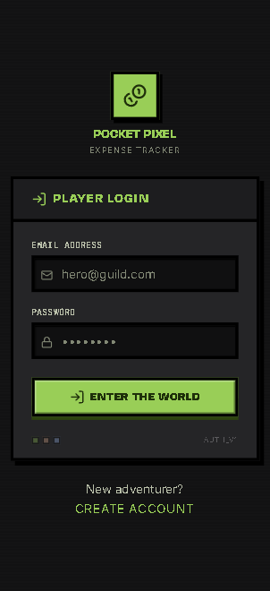

<div align="center">

# Pocket Pixel — Expense Tracker

**Level up your finances. Track every coin, quest every habit.**

[](LICENSE)
[](https://www.typescriptlang.org/)
[](https://nextjs.org/)
[](https://expressjs.com/)
[](https://typeorm.io/)
[](CONTRIBUTING.md)
[](https://github.com/propo41/expense_tracker)

</div>

---

<div align="center">

### Screenshots

| Login | Dashboard | Analytics |
|-------|-----------|-----------|
|  |  |  |

> **Contributors:** Drop screenshots of the Dashboard and Analytics pages into `assets/` and update the links above!

</div>

---

## What is Pocket Pixel?

Pocket Pixel is a **gamified personal finance tracker** built for people who want to make budgeting actually fun. Inspired by retro RPG aesthetics, it wraps your income and expenses in a pixel-art UI where categories become **Vaults**, habits become **Quests**, and every transaction is part of your financial adventure.

- **Vaults** — organize spending into themed buckets (food, rent, subscriptions, anything)
- **Recurring Quests** — automate repeating transactions on daily, weekly, monthly, or yearly schedules
- **Tags** — label transactions with custom icons and colors for granular analytics
- **Analytics** — monthly and yearly breakdowns, tag-based insights
- **Profiles** — pick your avatar and make it your own

---

## Tech Stack

| Layer | Technology |
|-------|-----------|
| Frontend | Next.js 14 (App Router), React 18, TypeScript, Tailwind CSS |
| Backend | Express.js, TypeORM, SQLite (better-sqlite3) |
| Auth | JWT (30-day sessions), bcryptjs password hashing |
| Scheduling | node-cron (recurring transaction automation) |
| Validation | Joi |
| Process Manager | PM2 |
| Monorepo | npm workspaces |

---

## ⚠️ Caution

This project was entirely **vibe coded** with claude, gemini models, and codex. The UI was designed with Google stitch. It is full of sloppy code and possible bugs with many features still under development.

**Google stitch**: https://stitch.withgoogle.com/projects/14795631199624450898


---

## Project Structure

```
pocket_pixel/
├── packages/
│   ├── api/          # Express REST API + TypeORM entities
│   │   └── src/
│   │       ├── entities/     # User, Expense, Vault, Tag, TransactionTag
│   │       ├── routes/       # auth, users, transactions, vaults, tags, recurring, analytics
│   │       ├── middleware/   # JWT auth, error handling
│   │       └── scheduler/   # node-cron recurring job manager
│   │
│   ├── ui/           # Next.js frontend
│   │   └── src/
│   │       ├── app/          # Dashboard, Profile, Stats, Auth pages
│   │       ├── components/   # Modals, AppBar, Nav, UI primitives
│   │       └── lib/          # API clients, helpers, icon mapper
│   │
│   └── shared/       # Shared TypeScript types/interfaces
│
├── ecosystem.config.js   # PM2 production config
├── tsconfig.base.json
└── package.json          # Workspace root
```

---

## Getting Started

### Prerequisites

- Node.js ≥ 18
- npm ≥ 9

### Clone the repo

```bash
git clone https://github.com/propo41/expense_tracker.git
cd expense_tracker
npm install
```

### Development

Run the API and UI in separate terminals:

```bash
# Terminal 1 — API (http://localhost:4000)
npm run dev:api

# Terminal 2 — UI (http://localhost:3000)
npm run dev:ui
```

### Production Build

```bash
# Build shared → UI → API in order
npm run build:prod

# Start the server (API serves the compiled UI)
npm run start
# → http://localhost:4000
```

---

## API Reference

All endpoints are prefixed with `/api`. Protected routes require an `Authorization: Bearer <token>` header.

---

## Database Schema

SQLite database managed via TypeORM with migrations.

```
users            — id, name, email, password, avatar
expenses         — id, userId, title, amount, type, date, interval, vaultId, deletedAt
vaults           — id, userId, name, description, icon, backgroundColor, isDefault, deletedAt
tags             — id, userId, name, icon, backgroundColor
transaction_tags — transactionId, tagId  (junction table)
```

Run migrations:

```bash
npm run migration:run        # Apply pending migrations
npm run migration:generate   # Generate migration from entity changes
npm run migration:revert     # Roll back the last migration
```

---

## Features In Depth

### Vaults
Organize your money into custom buckets — think of them as tagged envelopes. Each vault has a name, icon (from Lucide), background color, and can be marked as your default. Transactions without a vault fall into the default one.

### Recurring Quests
Set a transaction to auto-repeat on a schedule (`daily` / `weekly` / `monthly` / `yearly`). The API scheduler restores all active quests on startup using node-cron, so nothing gets missed between restarts.

### Analytics
Three views to understand your spending:
- **Tag breakdown** — which labels are eating your budget
- **Monthly report** — income vs. expenses by month
- **Yearly report** — long-term trend across all months

### Authentication
- Passwords hashed with bcryptjs (12 salt rounds)
- JWT tokens with 30-day expiration stored in localStorage
- Auth guard on all protected frontend routes

---

## Contributing

Contributions are what make open source awesome. All skill levels welcome — whether it's fixing a typo, adding a new feature, or improving the docs.

### Good First Issues to Tackle

- [ ] Add dark/light theme toggle
- [ ] Export transactions as CSV
- [ ] Add a budget limit per vault with progress bar
- [ ] Multi-currency support with conversion
- [ ] Better mobile responsiveness
- [ ] E2E tests (Playwright or Cypress)
- [ ] Docker Compose setup for easier local dev
- [ ] Add more avatar options
- [ ] Keyboard shortcuts for power users
- [ ] PWA support (installable on mobile)

### How to Contribute

1. **Fork** the repository
2. **Create** a feature branch
   ```bash
   git checkout -b feat/your-feature-name
   ```
3. **Make** your changes — keep commits focused and descriptive
4. **Test** your changes locally (both `dev:api` and `dev:ui`)
5. **Push** your branch and **open a Pull Request**

### Code Style

- Prettier is configured — run `npm run format` before committing
- TypeScript strict mode is enforced
- Keep components small and single-purpose
- Name things clearly — no abbreviations unless obvious

### Reporting Bugs

Open an issue with:
- What you expected vs. what happened
- Steps to reproduce
- Your OS and Node.js version

---

## Roadmap

| Status | Feature |
|--------|---------|
| ✅ | Transaction CRUD |
| ✅ | Vaults & Tags |
| ✅ | Recurring Quests |
| ✅ | Monthly/Yearly Analytics |
| ✅ | JWT Authentication |
| 🚧 | Budget limits per vault |
| 🚧 | CSV export |
| 📋 | Multi-currency support |
| 📋 | PWA / offline mode |
| 📋 | Docker Compose setup |

---

## License

MIT — do whatever you want with it. See [LICENSE](LICENSE) for details.

---

<div align="center">

Made with ☕ and a lot of pixel art inspiration.

**[⬆ Back to top](#-pocket-pixel--expense-tracker)**

</div>
