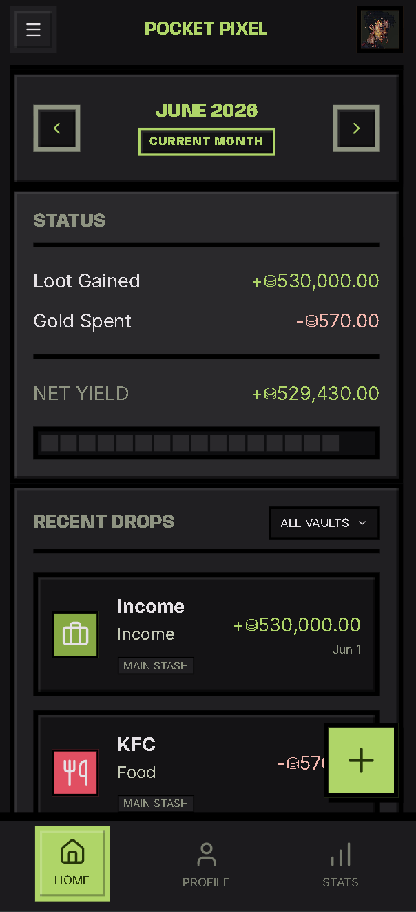
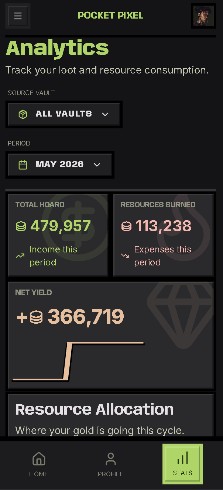

<div align="center">

# Pocket Pixel — Expense Tracker

**Level up your finances. Track every coin, quest every habit.**

[](https://github.com/ali-ahnaf/pocket_pixel/actions/workflows/ci-cd.yml)
[](LICENSE)
[](https://www.typescriptlang.org/)
[](https://nextjs.org/)
[](https://expressjs.com/)
[](https://typeorm.io/)
[](CONTRIBUTING.md)
[](https://github.com/ali-ahnaf/pocket_pixel)

</div>

---

<div align="center">

### Screenshots

| Dashboard                        | Analytics                             |
| -------------------------------- | ------------------------------------- |
|  |  |

</div>

---

## What is Pocket Pixel?

Pocket Pixel is a **gamified personal finance tracker** built for people who want to make budgeting actually fun. Inspired by retro RPG aesthetics, it wraps your income and expenses in a pixel-art UI where categories become **Vaults**, habits become **Quests**, and every transaction is part of your financial adventure.

- **Vaults** — organize spending into themed buckets (food, rent, subscriptions, anything)
- **Recurring Quests** — automate repeating transactions on daily, weekly, monthly, or yearly schedules
- **Tags** — label transactions with custom icons and colors for granular analytics
- **Analytics** — monthly and yearly breakdowns, tag-based insights
- **Profiles** — pick your avatar and make it your own

---

## Tech Stack

| Layer           | Technology                                                  |
| --------------- | ----------------------------------------------------------- |
| Frontend        | Next.js 14 (App Router), React 18, TypeScript, Tailwind CSS |
| Backend         | Express.js, TypeORM, SQLite (better-sqlite3)                |
| Auth            | JWT (30-day sessions), bcryptjs password hashing            |
| Scheduling      | node-cron (recurring transaction automation)                |
| Validation      | Joi                                                         |
| Process Manager | PM2                                                         |
| Monorepo        | npm workspaces                                              |

---

## ⚠️ Caution

This project was entirely **vibe coded** with claude, gemini models, and codex. The UI was designed with Google stitch. It is full of sloppy code and possible bugs with many features still under development.

**Google stitch**: https://stitch.withgoogle.com/projects/14795631199624450898

## Agentic coding

The repository has a bunch of skills/rules defined in `.agents` or `.claude` folders. These are supported by codex and gemini models.

---

## Project Structure

```
pocket_pixel/
├── packages/
│   ├── api/          # Express REST API + TypeORM entities
│   │   └── src/
│   │       ├── entities/     # User, Expense, Vault, Tag, TransactionTag
│   │       ├── routes/       # auth, users, transactions, vaults, tags, recurring, analytics
│   │       ├── middleware/   # JWT auth, error handling
│   │       └── scheduler/   # node-cron recurring job manager
│   │
│   ├── ui/           # Next.js frontend
│   │   └── src/
│   │       ├── app/          # Dashboard, Profile, Stats, Auth pages
│   │       ├── components/   # Modals, AppBar, Nav, UI primitives
│   │       └── lib/          # API clients, helpers, icon mapper
│   │
│   └── shared/       # Shared TypeScript types/interfaces
│
├── ecosystem.config.js   # PM2 production config
├── tsconfig.base.json
└── package.json          # Workspace root
```

---

## Getting Started

### Prerequisites

- Node.js ≥ 18
- npm ≥ 9

### Clone the repo

```bash
git clone git@github.com:ali-ahnaf/pocket_pixel.git
cd pocket_pixel
npm install
npm run build:shared # builds shared dependencies
npm run migration:run # creates/updates the .sql file
```

### Create .env files

Create `.env` files for both the api and the ui

- Copy `.env.example` to `.env` for both the api and the ui
- Fill the .env files with the appropriate values (or keep the defaults for local development)

### Development

Run the API and UI in separate terminals:

```bash
# Terminal 1 — API (http://localhost:4000)
npm run dev:api

# Terminal 2 — UI (http://localhost:3000)
npm run dev:ui
```

### Test

```bash
# API tests
npm run test:api

# UI E2E tests
npm run test:e2e
```

### Production Build

```bash
# Build shared → UI → API in order
npm run build:prod

# run migrations and saves the file in /var/www/pocket_pixel
npm run migration:run-prod

# Start the server (API serves the compiled UI)
pm2 start ecosystem.config.js
# → http://localhost:4000
```

---

## API Reference

All endpoints are prefixed with `/api`. Protected routes require an `Authorization: Bearer <token>` header.

---

## Database Schema

SQLite database managed via TypeORM with migrations.

Run migrations:

```bash
npm run migration:run        # Apply pending migrations
npm run migration:generate   # Generate migration from entity changes
npm run migration:revert     # Roll back the last migration
```

---

## Features In Depth

### Vaults

Organize your money into custom buckets — think of them as tagged envelopes. Each vault has a name, icon (from Lucide), background color, and can be marked as your default. Transactions without a vault fall into the default one.

### Recurring Quests

Set a transaction to auto-repeat on a schedule (`daily` / `weekly` / `monthly` / `yearly`). The API scheduler restores all active quests on startup using node-cron, so nothing gets missed between restarts.

### Analytics

Three views to understand your spending:

- **Tag breakdown** — which labels are eating your budget
- **Monthly report** — income vs. expenses by month
- **Yearly report** — long-term trend across all months


---

## Contributing

Contributions are what make open source awesome. All skill levels welcome — whether it's fixing a typo, adding a new feature, or improving the docs.

### How to Contribute

1. **Fork** the repository
2. **Create** a feature branch
   ```bash
   git checkout -b feat/your-feature-name
   ```
3. **Make** your changes — keep commits focused and descriptive
4. **Test** your changes locally (both `dev:api` and `dev:ui`)
5. **Push** your branch and **open a Pull Request**

### Code Style

- Prettier is configured
- TypeScript strict mode is enforced
- Keep components small and single-purpose
- Name things clearly — no abbreviations unless obvious
- Do not make changes in the file that are not relevant to the task at hand.

### Reporting Bugs

Open an issue with:

- What you expected vs. what happened
- Steps to reproduce
- Your OS and Node.js version

---

## ⚔️ The Adventuring Party

```
    ╔═══════════════════════════════════════════════════╗
    ║   ★  P A R T Y   R O S T E R  ★                    ║
    ║   These brave heroes joined the quest to slay      ║
    ║   the dreaded budget-goblins of Pocket Pixel.      ║
    ╚═══════════════════════════════════════════════════╝
```

<div align="center">

<!-- CONTRIBUTORS:START -->


<table>
  <tr>
    <td align="center">
      <a href="https://github.com/ali-ahnaf">
        <br/>
        <sub><b>ali-ahnaf</b></sub>
      </a><br/>
      
    </td>
    <td align="center">
      <a href="https://github.com/namahu">
        <br/>
        <sub><b>namahu</b></sub>
      </a><br/>
      
    </td>
    <td align="center">
      <a href="https://github.com/uttam12331">
        <br/>
        <sub><b>uttam12331</b></sub>
      </a><br/>
      
    </td>
    <td align="center">
      <a href="https://github.com/Wasif123-rgb">
        <br/>
        <sub><b>Wasif123-rgb</b></sub>
      </a><br/>
      
    </td>
  </tr>
  <tr>
    <td align="center">
      <a href="https://github.com/sihab-hasan">
        <br/>
        <sub><b>sihab-hasan</b></sub>
      </a><br/>
      
    </td>
    <td align="center">
      <a href="https://github.com/Asif177164">
        <br/>
        <sub><b>Asif177164</b></sub>
      </a><br/>
      
    </td>
    <td align="center">
      <a href="https://github.com/Diyaaa-12">
        <br/>
        <sub><b>Diyaaa-12</b></sub>
      </a><br/>
      
    </td>
    <td align="center">
      <a href="https://github.com/afija0022-655">
        <br/>
        <sub><b>afija0022-655</b></sub>
      </a><br/>
      
    </td>
  </tr>
  <tr>
    <td align="center">
      <a href="https://github.com/developmentwithparth1311">
        <br/>
        <sub><b>developmentwithparth1311</b></sub>
      </a><br/>
      
    </td>
    <td align="center">
      <a href="https://github.com/isratarna">
        <br/>
        <sub><b>isratarna</b></sub>
      </a><br/>
      
    </td>
    <td align="center">
      <a href="https://github.com/jemifish0-0">
        <br/>
        <sub><b>jemifish0-0</b></sub>
      </a><br/>
      
    </td>
    <td align="center">
      <a href="https://github.com/DARKRAI-yan">
        <br/>
        <sub><b>DARKRAI-yan</b></sub>
      </a><br/>
      
    </td>
  </tr>
  <tr>
    <td align="center">
      <a href="https://github.com/MFA-G">
        <br/>
        <sub><b>MFA-G</b></sub>
      </a><br/>
      
    </td>
    <td align="center">
      <a href="https://github.com/Srabon006">
        <br/>
        <sub><b>Srabon006</b></sub>
      </a><br/>
      
    </td>
    <td align="center">
      <a href="https://github.com/Ishrat-alt">
        <br/>
        <sub><b>Ishrat-alt</b></sub>
      </a><br/>
      
    </td>
    <td align="center">
      <a href="https://github.com/IsratHossainSnigdha">
        <br/>
        <sub><b>IsratHossainSnigdha</b></sub>
      </a><br/>
      
    </td>
  </tr>
  <tr>
    <td align="center">
      <a href="https://github.com/miftahuljannat850-netizen">
        <br/>
        <sub><b>miftahuljannat850-netizen</b></sub>
      </a><br/>
      
    </td>
    <td align="center">
      <a href="https://github.com/urmee111">
        <br/>
        <sub><b>urmee111</b></sub>
      </a><br/>
      
    </td>
    <td align="center">
      <a href="https://github.com/NujhatMaliha99">
        <br/>
        <sub><b>NujhatMaliha99</b></sub>
      </a><br/>
      
    </td>
    <td align="center">
      <a href="https://github.com/SarahZaman1310">
        <br/>
        <sub><b>SarahZaman1310</b></sub>
      </a><br/>
      
    </td>
  </tr>
  <tr>
    <td align="center">
      <a href="https://github.com/SheikhMahmudArman">
        <br/>
        <sub><b>SheikhMahmudArman</b></sub>
      </a><br/>
      
    </td>
    <td align="center">
      <a href="https://github.com/Talha-Morshed">
        <br/>
        <sub><b>Talha-Morshed</b></sub>
      </a><br/>
      
    </td>
    <td align="center">
      <a href="https://github.com/abidhasan176">
        <br/>
        <sub><b>abidhasan176</b></sub>
      </a><br/>
      
    </td>
    <td align="center">
      <a href="https://github.com/ahona030">
        <br/>
        <sub><b>ahona030</b></sub>
      </a><br/>
      
    </td>
  </tr>
  <tr>
    <td align="center">
      <a href="https://github.com/ayesha523">
        <br/>
        <sub><b>ayesha523</b></sub>
      </a><br/>
      
    </td>
    <td align="center">
      <a href="https://github.com/faysaliqbal007">
        <br/>
        <sub><b>faysaliqbal007</b></sub>
      </a><br/>
      
    </td>
    <td align="center">
      <a href="https://github.com/irin123-hash">
        <br/>
        <sub><b>irin123-hash</b></sub>
      </a><br/>
      
    </td>
    <td align="center">
      <a href="https://github.com/minhalriaz">
        <br/>
        <sub><b>minhalriaz</b></sub>
      </a><br/>
      
    </td>
  </tr>
  <tr>
    <td align="center">
      <a href="https://github.com/tashrik404">
        <br/>
        <sub><b>tashrik404</b></sub>
      </a><br/>
      
    </td>
  </tr>
</table>
<!-- CONTRIBUTORS:END -->

<br/>

<em>🗡️ Want to join the party? Grab a quest from the <a href="../../issues">issue board</a> and roll for initiative.</em>

</div>

---

## License

MIT — do whatever you want with it. See [LICENSE](LICENSE) for details.

---

<div align="center">

Made with ☕ and a lot of pixel art inspiration.

**[⬆ Back to top](#-pocket-pixel--expense-tracker)**

</div>
